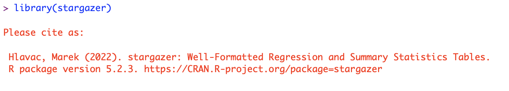

## Nudging Citations to Software

### Macro Concerns

1. Lack of Incentives for the Production of High-Quality Software. Software's role in enabling and accelerating research cannot be understated. But the incentives for producing software in academia are still very thin. One reason is that people do not cite the software they use; the academic currency is still citations.

2. Lack of Good Ways to Track the Consequences of Software Bugs (Errors). Research outputs are a function of the code researchers write themselves and the third-party developer code they use. Let's assume that the peer review process vets the code written by the researcher. This leaves code written by third-party developers. What precludes errors in third-party code? Not much. The code is generally not peer-reviewed though there are efforts underway. There is also no easy way to track the impact of bugs in third-party code on research outputs.

### Citations Are the Wrong Long Term Solution

Conventional reference lists (~ a bad database) are a bad way to address the macro concerns but are likely a good short-term solution for #1. 

If all the research code is committed to a system like Github (Dataverse lacks the tools for #2) with enough meta information about (the precise verison of the) third-party software being used, e.g., import statements in R, etc., we can create a system like the [Github dependency graph](https://docs.github.com/en/rest/dependency-graph?apiVersion=2022-11-28) to calculate the number of times a software has been used (and these metrics can be shown on Google Scholar, etc.) and also create systems that trigger warnings to authors when consquential updates to underlying software are made.

### How to Nudge Citations to Software?

One reason researchers do not cite software is that they don't see others doing it. One way to cue that software should be cited is to show a message when the software is loaded --- please cite the software. Such a message can also serve as a reminder for people who merely forget to cite the software. For instance, my hunch is that one of the [stargazer](https://scholar.google.com/citations?user=jRCc4kMAAAAJ&hl=en) has been cited more than 1,000 times (June 2023) is because the package produces a message `.onAttach` to remind the user to cite the package. 

## Initial 'Experiments'

* https://github.com/s3alfisc/fwildclusterboot/pull/125
* https://github.com/kosukeimai/wru/pull/102

## Plan

* Write software to PR a list of R and Python packages on Github with a similar message.

### References

* https://gojiberries.io/2019/03/22/countpy-incentivizing-more-and-better-software/